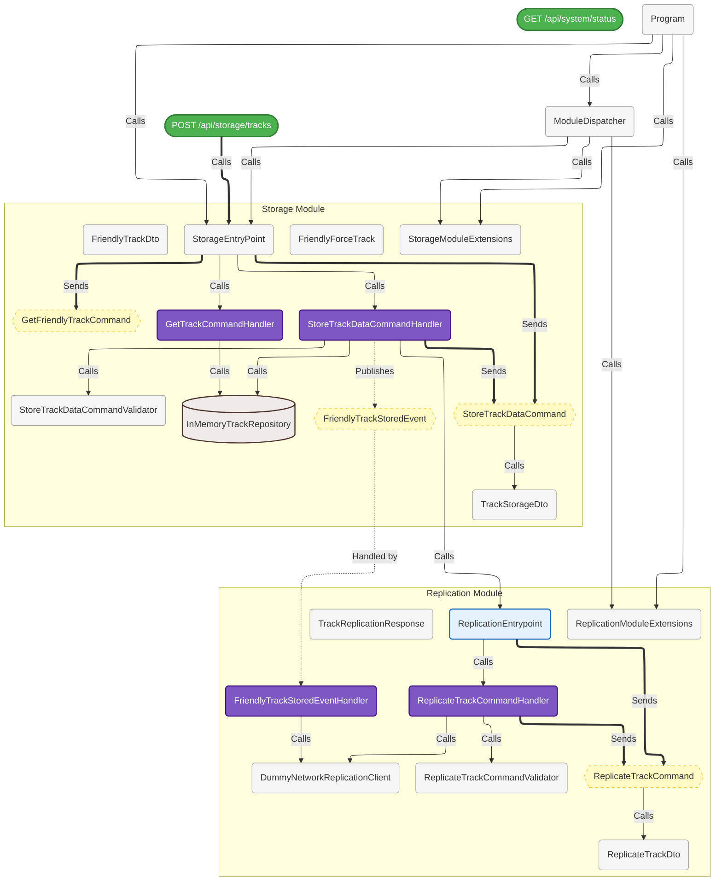

# Modulith.Template.Pragmatic

> **CEMM — Compiler Enforced Modular Monolith.** A .NET pattern where module boundaries are enforced by the Roslyn compiler, not convention. Cross-module violations, interface leaks, and event ownership breaches become build errors. If it violates the architecture, it doesn't compile.

---

## What is CEMM?

Most modular monolith architectures rely on convention. Modules are isolated by agreement — developers know not to reference across boundaries, and that agreement holds until it doesn't.

CEMM takes a different approach. By embedding architectural rules directly into the Roslyn compiler pipeline, violations are caught the moment you type them. There is no "I'll fix it later." There is no gradual erosion of boundaries over time. The compiler is the architecture guardian, and it never gets tired, never misses a PR, and never makes exceptions.

---

## Features

- **Custom Roslyn Analyzer** — five compile-time rules (MOD001–MOD005) that enforce module isolation, entrypoint purity, DI constraints, and event ownership
- **Incremental Source Generator** — automatically generates a C4 Level 3 Component Diagram in Mermaid syntax, kept in sync with your code at every build
- **Entry-Point Pattern** — each module exposes exactly one typed interface to the outside world; all internal types are invisible to other modules
- **Dual Communication Demo** — working examples of both synchronous (entry-point) and asynchronous (event bus) cross-module communication
- **Result&lt;T&gt; Type** — functional-style error handling with HTTP-mappable error categories
- **`.editorconfig`-driven configuration** — no XML, no NuGet config; architectural rules are configured in a file every .NET developer already knows

---

## The Rules

All rules are configured as `severity = error` — violations break the build.

| Rule | Name | Description |
|------|------|-------------|
| `MOD001` | Invalid Cross-Module Reference | No cross-module state. Foreign module types cannot be stored as fields, properties, or primary constructor parameters. |
| `MOD002` | Stateless Entrypoints | Entrypoint interfaces must define behavior only. Public properties and fields are forbidden. |
| `MOD003` | No Internal Interface Leaks | Foreign module internal interfaces cannot be injected or depended upon. Only the explicit `I{Module}Entrypoint` is permitted. |
| `MOD004` | Service Locator Anti-Pattern | `IServiceProvider` cannot be injected into constructors. Dependencies must be statically typed. |
| `MOD005` | Event Ownership | A module can only publish events it owns. Foreign event publishing is banned. |

### What is still allowed

| Pattern | Allowed |
|---------|---------|
| Inject a foreign module's `IEntrypoint` interface | ✅ |
| Subscribe to (handle) a foreign module's events | ✅ |
| Use foreign DTOs inside method bodies and parameters | ✅ |
| Reference `BuildingBlocks`, `Shared`, `Common` namespaces | ✅ (configurable exemptions) |

---

## Project Structure

```
src/
├── BuildingBlocks/
│   ├── Modulith.Template.Pragmatic.Analyzer          # Roslyn analyzer (MOD001–MOD005)
│   ├── Modulith.Template.Pragmatic.MermaidDiagram    # C4 diagram source generator
│   ├── Modulith.Template.Pragmatic.DomainEventDispatcher  # In-process event bus
│   ├── Modulith.Template.Pragmatic.Result            # Result<T> / ErrorType
│   └── Modulith.Template.Pragmatic.Shared            # IEvent / IEventHandler<T>
├── Modules/
│   ├── Storage/                                      # Demo module (stores tracks)
│   │   ├── Application/   # Command handlers, entry-point implementation
│   │   ├── Domain/        # FriendlyForceTrack entity
│   │   ├── Infrastructure/ # InMemoryTrackRepository
│   │   └── Contracts/     # IStorageEntryPoint, DTOs, events
│   └── Replication/                                  # Demo module (replicates tracks)
│       ├── Application/   # Command handlers, event handlers, entry-point
│       ├── Infrastructure/ # DummyNetworkReplicationClient
│       └── Contracts/     # IReplicationEntryPoint, DTOs
└── Modulith.Template.Pragmatic.WebApi                # Host — registers modules, minimal API
```

---

## Cross-Module Communication

This template demonstrates both communication patterns side by side.

### Synchronous — via Entry-Point

One module calls another directly through its public entry-point interface. The caller never sees internal types.

```csharp
// Storage module calls Replication module synchronously
public class StoreTrackDataCommandHandler
{
    private readonly IReplicationEntryPoint _replicationEntrypoint; // ← only the interface

    public async Task<Result<bool>> HandleAsync(StoreTrackDataCommand command)
    {
        await _repository.SaveAsync(track);
        await _replicationEntrypoint.TriggerReplicationAsync(replicationDto); // ← sync call
    }
}
```

### Asynchronous — via Event Bus

One module publishes an event. Any other module can subscribe without the publisher knowing who is listening.

```csharp
// Storage module publishes an event after saving
await _eventDispatcher.PublishAsync(new FriendlyTrackStoredEvent());

// Replication module handles it — zero coupling to Storage internals
public class FriendlyTrackStoredEventHandler : IEventHandler<FriendlyTrackStoredEvent>
{
    public async Task Handle(FriendlyTrackStoredEvent domainEvent, CancellationToken ct)
    {
        await _networkReplicationClient.TransmitTrackAsync(...);
    }
}
```

---

## Referencing the Analyzer

Add this to any project that should have boundaries enforced:

```xml
<ItemGroup>
  <ProjectReference
    Include="..\BuildingBlocks\Modulith.Template.Pragmatic.Analyzer\Modulith.Template.Pragmatic.Analyzer.csproj"
    OutputItemType="Analyzer"
    ReferenceOutputAssembly="false" />
</ItemGroup>
```

---

## Configuration

Rules are configured via `.editorconfig` at the solution root:

```ini
root = true

[*.cs]
modulith.root_namespace = Modulith.Template.Pragmatic
modulith.architectural_layers = Application, Domain, Infrastructure, Contracts
modulith.exempt_keywords = BuildingBlocks, Shared, Common

dotnet_diagnostic.MOD001.severity = error
dotnet_diagnostic.MOD002.severity = error
dotnet_diagnostic.MOD003.severity = error
dotnet_diagnostic.MOD004.severity = error
dotnet_diagnostic.MOD005.severity = error
```

| Key | Description |
|-----|-------------|
| `modulith.root_namespace` | The root namespace used to identify module boundaries |
| `modulith.architectural_layers` | Layer names recognised inside each module |
| `modulith.exempt_keywords` | Namespace segments that bypass all boundary rules entirely |

---

## Living Architecture Diagrams

The `MermaidDiagram` building block is a Roslyn incremental source generator. At every build it walks the compiled symbol tree, resolves interfaces to their concrete implementations, tracks event dispatch paths, and emits a C4 Level 3 Component Diagram — both as an embedded `.cs` file and a standalone `.mmd` file on disk.

No manual documentation. The diagram is always accurate because it is generated from the code.

### How it works

Reference the generator the same way as the analyzer — as a project reference with `OutputItemType="Analyzer"`:

```xml
<ItemGroup>
  <ProjectReference
    Include="..\BuildingBlocks\Modulith.Template.Pragmatic.MermaidDiagram\Modulith.Template.Pragmatic.MermaidDiagram.csproj"
    OutputItemType="Analyzer"
    ReferenceOutputAssembly="false" />
</ItemGroup>
```

On every build the generator produces a `ComponentDiagram.mmd` file in the project output directory. The diagram below is the actual output generated from this template's source — no hand-authoring involved.

### Generated output



### Reading the diagram

| Style | Meaning |
|-------|---------|
| 🟢 Green rounded box | HTTP endpoint |
| 🔵 Blue outlined box | Entry-point facade |
| 🟣 Purple filled box | Command / event handler |
| 🗄️ Cylinder | Repository / data store |
| 🟡 Dashed yellow hexagon | Command or event message |
| `==>` bold arrow | Command dispatch (send) |
| `-->` solid arrow | Direct method call |
| `-.->` dashed arrow | Async event publish / handled-by |

---

## Tech Stack

- .NET 10
- Roslyn (`Microsoft.CodeAnalysis`) — analyzer + incremental source generator
- FluentValidation — command validation
- xUnit + `Microsoft.CodeAnalysis.CSharp.Analyzer.Testing` — analyzer test suite

---

## License

MIT
