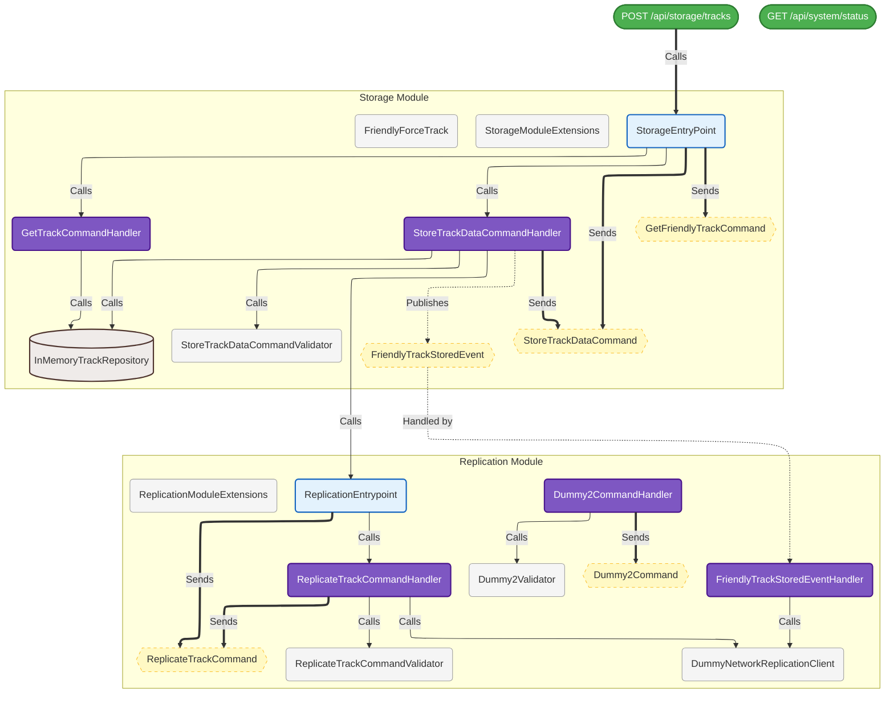

<div align="center">

<br/>

```
  ███╗   ███╗ ██████╗ ██████╗ ██╗   ██╗██╗     ██╗████████╗██╗  ██╗
  ████╗ ████║██╔═══██╗██╔══██╗██║   ██║██║     ██║╚══██╔══╝██║  ██║
  ██╔████╔██║██║   ██║██║  ██║██║   ██║██║     ██║   ██║   ███████║
  ██║╚██╔╝██║██║   ██║██║  ██║██║   ██║██║     ██║   ██║   ██╔══██║
  ██║ ╚═╝ ██║╚██████╔╝██████╔╝╚██████╔╝███████╗██║   ██║   ██║  ██║
  ╚═╝     ╚═╝ ╚═════╝ ╚═════╝  ╚═════╝ ╚══════╝╚═╝   ╚═╝   ╚═╝  ╚═╝
```

### **Compiler-Enforced Modular Monolith** for .NET

*Architectural boundaries that don't compile away*

<br/>

[](https://dotnet.microsoft.com)
[](LICENSE)
[](https://github.com/dotnet/roslyn)
[](#what-is-cemm)
[](#getting-started)

<br/>

> **If it violates the architecture, it doesn't compile.**

<br/>

</div>

---

## What is CEMM?

**CEMM — Compiler-Enforced Modular Monolith** is a .NET architectural pattern where module boundaries are enforced by the **Roslyn compiler**, not by convention, documentation, or goodwill.

Every modular monolith ever built starts with a shared agreement: *"we don't cross module boundaries."* That agreement holds until a deadline pressure arrives, a new developer joins, or someone just forgets. Over time, the monolith's internal structure quietly collapses. The modules remain as folder names, but the actual code is a tightly coupled mess.

CEMM ends this by making violations **compile errors**. The moment you type a forbidden cross-module reference, the IDE flags it — before any build, before any PR, before any damage is done. The compiler becomes the architecture guardian, and unlike humans, it never gets tired, never makes exceptions, and never forgets the rules.

This repository is a **production-ready .NET template** that implements the CEMM pattern out of the box.

---

## ✨ Features

| Feature | Description |
|---------|-------------|
| 🔴 **5 Compiler Rules (MOD001–MOD005)** | Roslyn diagnostics enforced as build errors — cross-module state, entrypoint leaks, interface injection, service locator, event ownership |
| 🔵 **Entry-Point Pattern** | Each module exposes exactly one typed interface. All internal types are invisible to other modules |
| 📡 **Dual Communication Demo** | Working examples of both synchronous (entry-point call) and asynchronous (event bus) cross-module communication |
| 🗺️ **Living Architecture Diagrams** | An incremental source generator produces a **C4 Level 3 Mermaid diagram on every build** — always accurate, never hand-maintained |
| 🧱 **`Result<T>` Type** | Functional-style error handling with `Map`, `Bind`, `Ensure`, `Tap`, `Match`, async extensions, and HTTP-mappable `ErrorType` |
| 💡 **MOD007 Code-Fix (Lightbulb)** | Empty handler detected? Press the lightbulb — the IDE scaffolds the full handler, command record, and optional FluentValidation validator |
| ⚙️ **`.editorconfig` Configuration** | Zero XML config. Architectural rules and exemptions live in a file every .NET developer already knows |
| 🧪 **Roslyn Analyzer Test Suite** | Full xUnit test coverage for all rules including edge cases, false-positive guards, and success paths |

---

## The Rules

All rules ship pre-configured as `severity = error`. Violations break the build.

### MOD001 — Invalid Cross-Module Reference

No cross-module state. A module cannot store a foreign module's types as fields, properties, or primary constructor parameters.

```csharp
// ❌ COMPILE ERROR — MOD001
// Module 'Replication' cannot reference 'TrackStorageDto' from module 'Storage'
public class ReplicationState
{
    private readonly TrackStorageDto _dto; // ← crosses the boundary as stored state
}

// ✅ ALLOWED — DTOs are fine inside method bodies and parameters
public async Task Handle(TrackStorageDto dto) { ... }
```

### MOD002 — Stateless Entrypoints

Entrypoint interfaces must define behavior only. Public properties and fields are forbidden on any type whose name ends in `Entrypoint`.

```csharp
// ❌ COMPILE ERROR — MOD002
public interface IStorageEntrypoint
{
    string LastCallsign { get; set; } // ← entrypoints must be behavior-only
}

// ✅ ALLOWED — methods only
public interface IStorageEntrypoint
{
    Task<Result<bool>> StoreTrackDataAsync(TrackStorageDto trackData);
}
```

### MOD003 — No Internal Interface Leaks

Only the explicit `I{ModuleName}Entrypoint` contract may cross module boundaries. Internal interfaces from a foreign module cannot be injected or depended upon.

```csharp
// ❌ COMPILE ERROR — MOD003
public class StorageHandler
{
    public StorageHandler(INetworkReplicationClient client) { } // ← internal Replication interface
}

// ✅ ALLOWED — only the entrypoint contract
public class StorageHandler
{
    public StorageHandler(IReplicationEntryPoint entrypoint) { } // ← the explicit contract
}
```

### MOD004 — Service Locator Anti-Pattern

`IServiceProvider` cannot be injected into constructors. All dependencies must be statically declared.

```csharp
// ❌ COMPILE ERROR — MOD004
public class MyHandler
{
    public MyHandler(IServiceProvider sp) { } // ← runtime lookup, not static contract
}
```

### MOD005 — Event Ownership

A module can only publish events it owns. A module in the `Replication` namespace cannot publish `FriendlyTrackStoredEvent` which lives in the `Storage.Contracts` namespace.

```csharp
// ❌ COMPILE ERROR — MOD005
// Module 'Replication' cannot publish 'FriendlyTrackStoredEvent' — it belongs to module 'Storage'
await _dispatcher.PublishAsync(new FriendlyTrackStoredEvent()); // ← called from Replication module

// ✅ ALLOWED — only the owning module publishes
// (inside Storage module)
await _dispatcher.PublishAsync(new FriendlyTrackStoredEvent()); // ← called from Storage module
```

### MOD007 — Unimplemented Handler (Warning + Lightbulb)

An empty handler class — a class named `*CommandHandler` or `*EventHandler` with no `Handle` method — fires a `suggestion` severity diagnostic with an IDE lightbulb that scaffolds the full boilerplate.

```csharp
// ⚠️ MOD007 warning + lightbulb
public class ProcessOrderCommandHandler { } // ← press 💡 to scaffold

// 💡 Generated by code-fix:
public class ProcessOrderCommandHandler : ICommandHandler<ProcessOrderCommand, Result>
{
    public async ValueTask<Result> Handle(ProcessOrderCommand command, CancellationToken ct = default)
    {
        throw new NotImplementedException();
    }
}

public record ProcessOrderCommand() : ICommand<Result>;
```

---

## What Is Still Allowed

The rules are precise — they ban state leakage and internal coupling, not legitimate cross-module interaction.

| Pattern | Verdict |
|---------|---------|
| Inject a foreign module's `IEntrypoint` interface | ✅ Allowed |
| Subscribe to (handle) a foreign module's events | ✅ Allowed |
| Use foreign DTOs inside method bodies and parameters | ✅ Allowed |
| Reference `BuildingBlocks`, `Shared`, `Common` namespaces | ✅ Allowed (configurable) |
| Store a foreign module type as a field or property | ❌ MOD001 |
| Inject a foreign module's internal interface | ❌ MOD003 |
| Inject `IServiceProvider` | ❌ MOD004 |
| Publish another module's events | ❌ MOD005 |

---

## Cross-Module Communication

This template demonstrates both communication patterns side by side in the demo modules.

### Synchronous — via Entry-Point

One module calls another directly through its public entry-point interface. The caller never sees internal types.

```csharp
// Inside Storage module — calls Replication module synchronously
public class StoreTrackDataCommandHandler
{
    private readonly IReplicationEntryPoint _replicationEntrypoint; // ← only the interface, never the impl

    public async Task<Result<bool>> HandleAsync(StoreTrackDataCommand command)
    {
        await _repository.SaveAsync(track);

        // Cross-module call goes through the contract only
        var result = await _replicationEntrypoint.TriggerReplicationAsync(replicationDto);
    }
}
```

### Asynchronous — via Event Bus

One module publishes a domain event. Any other module subscribes without the publisher knowing anything about who is listening.

```csharp
// Storage module publishes — it knows nothing about who handles this
await _eventDispatcher.PublishAsync(new FriendlyTrackStoredEvent());

// Replication module handles it — it knows nothing about Storage internals
public class FriendlyTrackStoredEventHandler : IEventHandler<FriendlyTrackStoredEvent>
{
    public async Task Handle(FriendlyTrackStoredEvent domainEvent, CancellationToken ct)
    {
        await _networkReplicationClient.TransmitTrackAsync(default);
    }
}
```

---

## Project Structure

```
Modulith.Template.Pragmatic/
├── src/
│   ├── BuildingBlocks/
│   │   ├── Modulith.Analyzer/              # Roslyn diagnostic analyzer (MOD001–MOD005, MOD007)
│   │   │   ├── ModulithAnalyzer.cs         # All rule implementations
│   │   │   └── CodeFixProvider.cs          # MOD007 handler scaffold lightbulb
│   │   ├── Modulith.ArchictureOverview/    # Incremental source generator → ComponentDiagram.mmd
│   │   │   └── MermaidGenerator.cs
│   │   ├── Modulith.DomainEventDispatcher/ # In-process async event bus
│   │   │   ├── EventDispatcher.cs
│   │   │   └── Contracts/
│   │   │       ├── IEvent.cs
│   │   │       ├── IEventDispatcher.cs
│   │   │       ├── ICommand.cs
│   │   │       ├── ICommandHandler.cs
│   │   │       └── Result.cs               # Result<T> / Result / ErrorType
│   │   └── Modulith.CodeFix/               # Shared analyzer helpers
│   │
│   ├── Modulith.WebApi/                    # Host — registers modules, minimal API
│   │   ├── Program.cs
│   │   ├── ComponentDiagram.mmd            # ← auto-generated on every build
│   │   └── Modules/
│   │       ├── Storage/                    # Demo module — track storage
│   │       │   ├── Application/
│   │       │   │   ├── CommandHandlers/
│   │       │   │   │   ├── StoreTrackDataCommandHandler.cs
│   │       │   │   │   └── GetTrackCommandHandler.cs
│   │       │   │   └── StorageEntryPoint.cs
│   │       │   ├── Contracts/              # ← PUBLIC SURFACE ONLY
│   │       │   │   ├── IStorageEntryPoint.cs
│   │       │   │   ├── FriendlyTrackDto.cs
│   │       │   │   ├── TrackStorageDto.cs
│   │       │   │   ├── IFriendlyTrackRepository.cs
│   │       │   │   └── FriendlyTrackStoredEvent.cs
│   │       │   ├── Domain/
│   │       │   │   └── FriendlyForceTrack.cs
│   │       │   └── Infrastructure/
│   │       │       └── InMemoryTrackRepository.cs
│   │       │
│   │       └── Replication/                # Demo module — cluster replication
│   │           ├── Application/
│   │           │   ├── CommandHandlers/
│   │           │   │   └── ReplicateFriendlyTrackCommandHandler.cs
│   │           │   ├── EventHandlers/
│   │           │   │   └── FriendlyTrackStoredEventHandler.cs
│   │           │   └── ReplicationEntryPoint.cs
│   │           ├── Contracts/              # ← PUBLIC SURFACE ONLY
│   │           │   ├── IReplicationEntryPoint.cs
│   │           │   ├── ReplicateTrackDto.cs
│   │           │   └── ReplicateFriendlyTrackResponse.cs
│   │           └── Infrastructure/
│   │               └── DummyNetworkReplicationClient.cs
│   │
│   └── Modulith.slnx
│
└── tests/
    └── Modulith.Analyzer.Tests/
        └── AnalyzerTests.cs                # xUnit tests for all MOD rules
```

---

## Getting Started

### Option 1 — Use as a `dotnet new` Template

```bash
# Install the template
dotnet new install Modulith.Template.Pragmatic

# Create a new solution
dotnet new modulith -n MyCompany.MyApp

# Build — the analyzer and diagram generator activate immediately
dotnet build
```

### Option 2 — Clone Directly

```bash
git clone https://github.com/your-org/modulith-template-pragmatic.git
cd modulith-template-pragmatic/src
dotnet build
```

### Adding a New Module

1. Create the folder structure under `Modules/YourModule/`:

```
Modules/YourModule/
├── Application/
│   ├── CommandHandlers/     # place *CommandHandler.cs files here
│   └── YourModuleEntryPoint.cs
├── Contracts/               # IYourModuleEntrypoint.cs + DTOs + Events
├── Domain/                  # entities, value objects
└── Infrastructure/          # repositories, clients, adapters
```

2. Register in a `YourModuleExtensions.cs`:

```csharp
public static class YourModuleExtensions
{
    public static IServiceCollection AddYourModule(this IServiceCollection services)
    {
        services.AddScoped<IYourModuleEntryPoint, YourModuleEntryPoint>();
        // register internal handlers, validators, infrastructure
        return services;
    }
}
```

3. Call `services.AddYourModule()` in `Program.cs`. The analyzer starts enforcing rules immediately.

---

## Configuration

All configuration lives in `.editorconfig` at the solution root — no XML, no NuGet packages, no custom build props.

```ini
root = true

[*.cs]
# Core CEMM configuration
modulith.architectural_layers = Application, Domain, Infrastructure, Contracts
modulith.exempt_keywords      = BuildingBlocks, Shared, Common, DomainEventDispatcher

# Rule severities — set to 'error' to break the build, 'warning' to warn, 'none' to disable
dotnet_diagnostic.MOD001.severity = error   # Invalid Cross-Module Reference
dotnet_diagnostic.MOD002.severity = error   # Stateless Entrypoints
dotnet_diagnostic.MOD003.severity = error   # No Internal Interface Leaks
dotnet_diagnostic.MOD004.severity = error   # Service Locator Anti-Pattern
dotnet_diagnostic.MOD005.severity = error   # Event Ownership

# MOD007 must stay 'suggestion' — 'none' disables the lightbulb entirely
dotnet_diagnostic.MOD007.severity = suggestion
```

| Key | Purpose |
|-----|---------|
| `modulith.architectural_layers` | Layer names recognised inside each module — used to identify module boundaries in namespace resolution |
| `modulith.exempt_keywords` | Namespace segments that bypass all rules — use for cross-cutting concerns like `BuildingBlocks`, `Shared`, `Common` |

---

## Living Architecture Diagrams

The `Modulith.ArchictureOverview` building block is a Roslyn **incremental source generator**. On every build it:

1. Walks the full compiled symbol tree
2. Resolves interfaces to their concrete implementations
3. Tracks synchronous call chains and async event dispatch paths
4. Emits a **C4 Level 3 Component Diagram** in Mermaid syntax

Two outputs are produced on every build:
- `ComponentDiagram.g.cs` — embedded as a `const string` accessible at runtime
- `ComponentDiagram.mmd` — written to the project directory (commit this to version control)

> **The diagram is always accurate because it is generated from the code.** No hand-authoring. No drift.

### Adding the generator to your project

```xml
<ItemGroup>
  <ProjectReference
    Include="..\BuildingBlocks\Modulith.ArchictureOverview\Modulith.ArchitectureOverview.csproj"
    OutputItemType="Analyzer"
    ReferenceOutputAssembly="false" />
</ItemGroup>
```

### Sample generated output (from this template's own source)



### Reading the diagram

| Style | Meaning |
|-------|---------|
| 🟢 Green rounded pill | HTTP endpoint |
| 🔵 Blue outlined box | Entry-point facade |
| 🟣 Purple filled box | Command / event handler |
| 🗄️ Cylinder | Repository / data store |
| 🟡 Dashed hexagon | Command or domain event message |
| `==>` bold arrow | HTTP or command call |
| `-->` solid arrow | Direct method delegation |
| `-.->` dashed arrow | Async event publish / handled-by |

---

## The `Result<T>` Type

A value-typed, allocation-efficient result monad with full functional API and HTTP-mappable error categories.

```csharp
// Creating results
Result<User> success = Result<User>.Success(user);
Result<User> notFound = Result<User>.NotFound("User with id 42 does not exist.");
Result<User> invalid  = Result<User>.Validation("Email address is required.");

// Chaining — short-circuits on the first failure
var result = await GetUserAsync(id)
    .BindAsync(user   => ValidateAsync(user))
    .BindAsync(user   => SaveAsync(user))
    .TapAsync(saved   => _cache.InvalidateAsync(saved.Id))
    .MatchAsync(
        onSuccess: saved  => Results.Ok(saved),
        onFailure: error  => Results.BadRequest(error)
    );

// HTTP mapping
return result.ErrorType switch
{
    ErrorType.NotFound     => Results.NotFound(result.Error),
    ErrorType.Validation   => Results.BadRequest(result.Error),
    ErrorType.Unauthorized => Results.Unauthorized(),
    ErrorType.Forbidden    => Results.Forbid(),
    ErrorType.Conflict     => Results.Conflict(result.Error),
    _                      => Results.BadRequest(result.Error)
};
```

| Method | Purpose |
|--------|---------|
| `Map<TOut>(Func<T, TOut>)` | Transform the value if successful |
| `Bind<TOut>(Func<T, Result<TOut>>)` | Chain an operation that can also fail |
| `Ensure(Func<T, bool>, string)` | Assert a predicate or return failure |
| `Tap(Action<T>)` | Side-effect on success, pass-through |
| `Match(onSuccess, onFailure)` | Branch on outcome |
| `Combine(params Result[])` | Aggregate multiple results into one |
| `Try(Action)` | Wrap an exception-throwing call |

---

## Adding the Analyzer to Existing Projects

The analyzer can be dropped into any existing .NET solution without restructuring.

```xml
<!-- Add to any .csproj that should have boundaries enforced -->
<ItemGroup>
  <ProjectReference
    Include="..\BuildingBlocks\Modulith.Analyzer\Modulith.Analyzer.csproj"
    OutputItemType="Analyzer"
    ReferenceOutputAssembly="false" />
</ItemGroup>
```

Then configure rules in your `.editorconfig`. Start with `severity = warning` to audit your existing codebase, then graduate to `severity = error` once violations are resolved.

---

## Tech Stack

| Component | Technology |
|-----------|-----------|
| Framework | .NET 10 |
| Analyzer engine | Roslyn (`Microsoft.CodeAnalysis.CSharp`) |
| Diagram generator | Roslyn Incremental Source Generator |
| Validation | FluentValidation |
| Testing | xUnit + `Microsoft.CodeAnalysis.CSharp.Analyzer.Testing` |
| Diagram format | Mermaid (C4 Level 3 Component Diagram) |

---

## FAQ

**Q: Does this work with vertical slice / feature folder structures?**  
Yes. The rule engine resolves module identity from namespace segments, not folder layout. Configure `modulith.architectural_layers` to match your actual layer names.

**Q: Can I turn off individual rules?**  
Yes — each rule is individually configurable in `.editorconfig`. Set to `none` to fully disable, `warning` to audit, `error` to enforce.

**Q: What about test projects — should they be exempt?**  
Add your test project namespace to `modulith.exempt_keywords` to opt them out of all boundary checks.

**Q: Does this work with source generators other than the included one?**  
Yes. The analyzer and generator are independent projects. Use either, both, or neither.

**Q: Does the diagram generator work with large codebases?**  
The generator is incremental — it only re-runs when the compilation changes. For very large codebases the `.mmd` output may become dense; the generator is designed to be filtered and extended.

**Q: Does MOD004 conflict with `EventDispatcher` which injects `IServiceProvider`?**  
`EventDispatcher` lives in the `DomainEventDispatcher` namespace which is included in `modulith.exempt_keywords` by default. The rule targets module-layer code only.

---

## Contributing

Contributions are welcome. Please open an issue before a pull request for anything beyond a bug fix, so the change can be discussed in context.

When adding new analyzer rules, follow the existing pattern:
1. Add the `DiagnosticDescriptor` to `ModuleBoundaryAnalyzer`
2. Add the rule ID constant to `AnalyzerHelper.cs`
3. Register corresponding tests in `AnalyzerTests.cs` covering at minimum: a failing case, a passing case, and one edge-case false-positive guard
4. Document the rule in this README

---

## License

MIT — see [LICENSE](LICENSE) for full terms.

---

<div align="center">

**Modulith.Template.Pragmatic** · CEMM for .NET

*Boundaries you can trust because the compiler checks them*

</div>